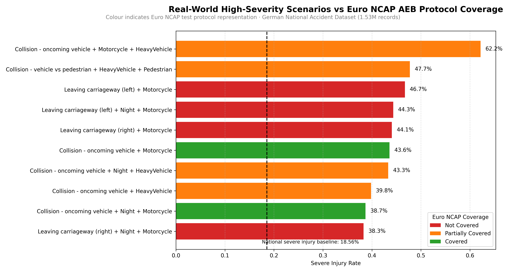
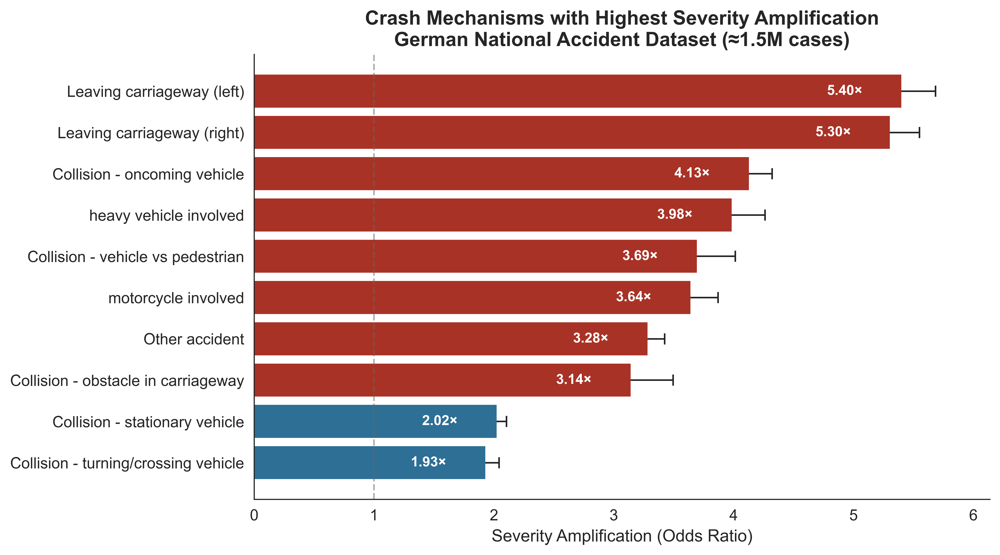
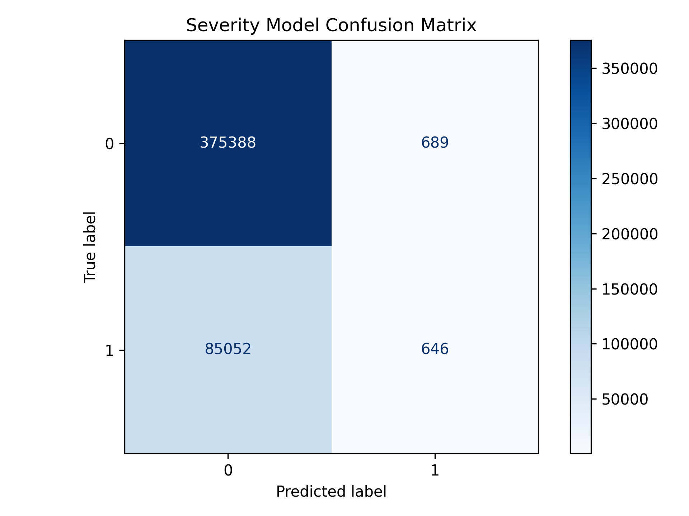
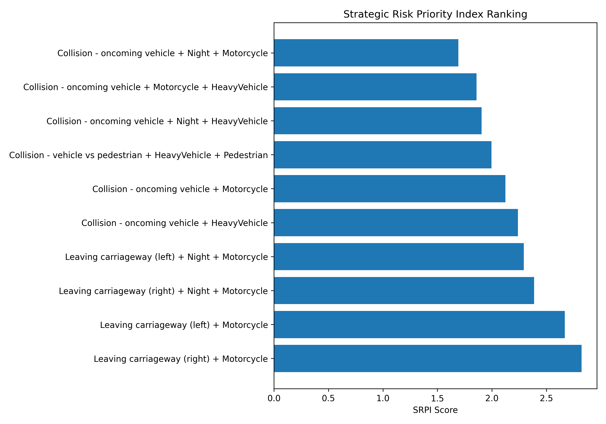

# ADAS Scenario Coverage Gap Analysis
## Using 1.53 Million German Crash Records to Identify Validation Blind Spots in Euro NCAP AEB Test Protocols

**Author:** Tejas Manjunath  
**Project Type:** Independent Research Investigation  
**Domain:** ADAS Validation · Automotive Safety · Crash Data Analysis

<br>

> **Core Finding:** Motorcycle leaving-carriageway crashes exhibit severe injury rates of 44–47% against a national baseline of 18.56% — yet none of these scenarios appear in current Euro NCAP AEB active safety test protocols. This project identifies that gap systematically, quantifies it statistically, and proposes a data-driven prioritisation framework for ADAS validation resource allocation. <br>

## Abstract

ADAS validation programs rely on predefined scenario catalogues, primarily defined by Euro NCAP, to determine which crash situations are tested during development. However, the relationship between these validation scenarios and the real-world distribution of severe injuries has not been systematically quantified using national-scale accident data.

This project analyses approximately **1.53 million German traffic accidents recorded between 2019 and 2024** to identify crash scenarios associated with the highest severe injury probabilities. A logistic regression severity model and compound scenario analysis were used to quantify severity amplification across crash mechanisms, road conditions, and participant types.

Results show that several high-severity crash scenarios — particularly **motorcycle leaving-carriageway crashes and complex oncoming collisions** — exhibit severe injury rates between **40% and 62%**, far above the national severe injury baseline of **18.56%**. Multiple such scenarios are either partially represented or completely absent in current Euro NCAP AEB test protocols.

To prioritise validation improvements, the study introduces a **Scenario Risk Priority Index (SRPI)** combining severity, protocol coverage gaps, and exposure frequency. The resulting framework provides a data-driven method for identifying which real-world crash scenarios should receive greater emphasis in ADAS validation programs.

## Key Findings

This analysis of **1.53 million German accident records** reveals several structural mismatches between real-world crash severity and current ADAS validation protocols.

**Major findings include:**

- **Leaving-carriageway crashes** show the strongest severity amplification in the dataset, with odds ratios of **~5.3–5.4×** relative to baseline crash conditions.
- **Motorcycle involvement** appears in **four of the top five SRPI-ranked scenarios**, indicating a disproportionately high injury risk in these interactions.
- Several high-severity scenarios — particularly **motorcycle leaving-carriageway events** — exhibit severe injury rates between **44% and 47%**, more than **2.4× higher than the national baseline (18.56%)**.
- Multiple of these scenarios are **not represented in current Euro NCAP AEB validation protocols**, indicating potential validation blind spots.

These findings suggest that **current validation scenario catalogues may not fully reflect the distribution of severe injury risk in real-world traffic environments.**

---


*Figure 1: Real-world high-severity compound scenarios mapped against Euro NCAP AEB protocol coverage status. Red = Not Covered. Orange = Partially Covered. Green = Covered. National severe injury baseline: 18.56%.*

<br>

---
## Table of Contents

1. [Project Overview](#1-project-overview)
2. [Motivation and Problem Statement](#2-motivation-and-problem-statement)
3. [Dataset](#3-dataset)
4. [Pipeline Architecture](#4-pipeline-architecture)
5. [Methodology](#5-methodology)
   - 5.1 [Data Engineering](#51-data-engineering)
   - 5.2 [Feature Engineering](#52-feature-engineering)
   - 5.3 [Statistical Severity Modelling](#53-statistical-severity-modelling)
   - 5.4 [Compound Amplification Analysis](#54-compound-amplification-analysis)
   - 5.5 [Injury Burden Concentration](#55-injury-burden-concentration)
   - 5.6 [Euro NCAP Coverage Gap Analysis](#56-euro-ncap-coverage-gap-analysis)
   - 5.7 [Scenario Risk Priority Index](#57-scenario-risk-priority-index)
   - 5.8 [Example Scenario Formalisation](#58-example-scenario-formalisation)
6. [Results](#6-results)
   - 6.1 [Severity Amplification by Mechanism](#61-severity-amplification-by-mechanism)
   - 6.2 [Compound Scenario Severity](#62-compound-scenario-severity)
   - 6.3 [Coverage Gap Findings](#63-coverage-gap-findings)
   - 6.4 [SRPI Rankings](#64-srpi-rankings)
7. [Engineering Implications for ADAS Systems](#7-engineering-implications-for-adas-systems)
8. [Visual Outputs](#8-visual-outputs)
9. [Conclusion](#9-conclusion)
10. [Limitations](#10-limitations)
11. [Future Work](#11-future-work)
12. [Repository Structure](#12-repository-structure)
13. [Tech Stack](#13-tech-stack)
14. [About This Project](#14-about-this-project)
---

## 1. Project Overview

Advanced Driver Assistance Systems (ADAS) are validated against standardised test scenarios defined by bodies such as Euro NCAP before they reach the market. These scenarios determine what a system is tested against — and by extension, what it may never have been designed to handle.

This project asks a fundamental question: **do the scenarios currently used to validate ADAS systems actually reflect where people are most severely injured on real roads?**

Using a dataset of approximately 1.53 million German national accident records, this analysis:

- Quantifies severe injury probability across crash mechanisms and compound scenario combinations
- Builds a logistic regression model with interaction terms to isolate the statistical contribution of each crash factor to severe injury probability
- Maps the highest-severity compound scenarios against the current Euro NCAP AEB Car-to-Car and Vulnerable Road User test protocols
- Introduces a **Scenario Risk Priority Index (SRPI)** — a weighted composite score for ranking validation gaps by real-world impact

The result is a structured, data-driven methodology for identifying which ADAS test scenarios are missing from current validation frameworks, and how validation priorities could be restructured to better reflect real-world crash severity distribution.

---

## 2. Motivation and Problem Statement

### The Validation Gap Problem

ADAS validation is expensive. Physical test tracks, simulation compute, and engineering time are finite resources. Validation teams rely on standardised scenario catalogues — primarily Euro NCAP protocols — to define what gets tested and how performance is scored.

The problem is that these standardised scenarios were not derived from a systematic statistical analysis of where severe injuries actually concentrate in national crash data. They are informed by safety research and expert knowledge, but the mapping between real-world crash severity distribution and protocol scenario coverage has not been formally quantified at scale.

This creates a potential blind spot: **scenarios that are insufficiently represented in standard protocols may carry disproportionately high injury severity — and ADAS systems may never be specifically tested against them.**

### Why This Matters: SOTIF

Under **SOTIF (ISO 21448 — Safety of the Intended Functionality)**, functional insufficiencies in ADAS arise not from system failure but from the system encountering situations it was not designed or validated to handle. This is the distinction between a system that is broken and a system that works correctly but was never tested against a particular real-world situation.

If high-severity crash topologies are systematically absent from validation test catalogues, ADAS systems may perform poorly in precisely those situations — not because they malfunction, but because those situations were never part of the validation envelope. The SOTIF framework explicitly requires that the space of unknown and insufficiently covered scenarios be systematically identified and reduced. This project provides a data-driven methodology for doing exactly that.

### The Research Question

> **Which real-world crash scenarios cause the most severe injuries but are missing or underrepresented in current ADAS validation test protocols — and how should validation resources be prioritised to address that gap?**

This project constructs a rigorous, reproducible answer to that question using national-scale accident data, statistical modelling, and direct protocol document analysis.

---

## 3. Dataset

| Attribute | Detail |
|-----------|--------|
| Source | German national accident database (Statistische Ämter des Bundes und der Länder) |
| Coverage | 2019–2024, multi-year |
| Total records | 1,539,249 accident cases |
| Raw file size | ~400 MB |
| Cleaned file size | ~180 MB |

### Key Variables Used

| Variable | Description |
|----------|-------------|
| `UKATEGORIE` | Injury severity category (fatal / severe / minor) |
| `accident_mechanism` | Crash type classification (leaving carriageway, oncoming, etc.) |
| `USTUNDE` | Hour of crash (0–23) |
| `ULAND` | German federal state code |
| `STRZUSTAND` | Road surface condition |
| Participant flags | Pedestrian, motorcycle, bicycle, heavy vehicle involvement |

### Severity Distribution

The dataset exhibits significant class imbalance typical of real-world accident data. The national baseline severe injury and fatality rate across all 1.53 million records is:

**Baseline severe injury rate: 18.56%**

This figure serves as the reference benchmark for all amplification and gap analysis calculations throughout the project. Every severity rate, odds ratio, and SRPI score is interpreted relative to this baseline.

> **Data availability note:** Raw data is not included in this repository due to file size and licensing constraints. The full cleaning and processing pipeline (`02_cleaning_pipeline.py`) is fully reproducible from the source. The cleaned feature dataset is available on request.

---

## 4. Pipeline Architecture

The project follows a closed-loop analytical pipeline across 14 scripts, structured in five logical layers:

```
Raw Crash Data (1.53M records)
        │
        ▼
┌──────────────────────────────────┐
│     DATA FOUNDATION (01–03)      │
│  Exploration · Cleaning ·        │
│  Feature Engineering             │
└──────────────┬───────────────────┘
               │
               ▼
┌──────────────────────────────────┐
│   SEVERITY STRUCTURE (04–07)     │
│  Descriptive Analysis ·          │
│  Logistic Regression ·           │
│  Odds Ratios · Publication Plots │
└──────────────┬───────────────────┘
               │
               ▼
┌──────────────────────────────────┐
│   COMPOUND ANALYSIS (08–12)      │
│  Risk × Exposure Framework ·     │
│  Multi-Factor Stacking ·         │
│  Burden Mapping · Synthesis      │
└──────────────┬───────────────────┘
               │
               ▼
┌──────────────────────────────────┐
│    GAP DETECTION (13)            │
│    Euro NCAP Protocol            │
│    Coverage Mapping              │       ← Core Finding
└──────────────┬───────────────────┘
               │
               ▼
┌──────────────────────────────────┐
│    PRIORITISATION (14)           │
│    Scenario Risk Priority Index  │       ← Actionable Recommendation
│    Validation Resource Ranking   │
└──────────────────────────────────┘
```

**The analytical logic:** Real crash data establishes the true severity structure of the road environment. Statistical modelling isolates and quantifies each factor's independent contribution. Compound analysis reveals how factors interact nonlinearly. Gap detection compares this structure against what protocols actually test. The SRPI produces a ranked, actionable prioritisation output that bridges data findings to validation engineering decisions.

---

## 5. Methodology

### Severity Amplification by Crash Mechanism



Crash mechanisms involving motorcycles, oncoming collisions, and leaving-carriageway events show the strongest amplification of severe injury probability relative to the national baseline.

### 5.1 Data Engineering

Raw multi-year accident records were processed through a structured cleaning pipeline (`02_cleaning_pipeline.py`):

- Irrelevant administrative and geographic columns removed
- Accident mechanism names normalised and standardised across multi-year records to ensure consistent categorisation
- Federal state labels standardised to official German state identifiers
- Corrupted, incomplete, and out-of-range entries removed
- Rare mechanism categories (below frequency threshold) collapsed into an `Other` category to prevent sparse cell problems in modelling
- Rare state categories collapsed into `Other` for the same reason
- Final cleaned dataset saved as `cleaned_accidents.pkl` for downstream pipeline use

### 5.2 Feature Engineering

The following derived features were constructed (`03_feature_engineering.py`):

**Severity flags — binary target construction**

| Feature | Definition |
|---------|-----------|
| `is_fatal` | UKATEGORIE == fatal |
| `is_severe` | UKATEGORIE == severe injury |
| `is_minor` | UKATEGORIE == minor injury |
| `is_high_severity` | `is_fatal` OR `is_severe` — primary model target |

**Environmental features**

| Feature | Definition |
|---------|-----------|
| `is_night` | Crash hour between 21:00–05:59 |
| `is_weekend` | Saturday or Sunday |
| `hour_bin` | Categorical: late_night / morning / afternoon / evening |

**Participant involvement flags**

| Feature | Definition |
|---------|-----------|
| `pedestrian_involved` | Pedestrian recorded as crash participant |
| `motorcycle_involved` | Motorcycle recorded as crash participant |
| `bicycle_involved` | Bicycle recorded as crash participant |
| `heavy_vehicle_involved` | HGV or bus recorded as crash participant |

**Categorical reductions**

| Feature | Definition |
|---------|-----------|
| `mechanism_clean` | Top 15 mechanisms by frequency retained; remainder → Other |
| `state_clean` | Top 10 states by frequency retained; remainder → Other |

**National baseline established:** `is_high_severity` mean across all records = **18.56%**

### 5.3 Statistical Severity Modelling

**Model:** Binary logistic regression
**Target:** `is_high_severity` (fatal or severe injury)
**Sample:** 30% stratified subsample — approximately 461,000 rows
**Predictors:** 58 columns after categorical encoding

**Full predictor structure:**

```
Main effects:
  C(mechanism_clean)          — crash mechanism (categorical, 15 levels)
  C(state_clean)              — federal state (categorical, 10 levels)
  C(hour_bin)                 — time period (categorical, 4 levels)
  STRZUSTAND                  — road surface condition (ordinal)
  is_night                    — binary
  is_weekend                  — binary
  pedestrian_involved         — binary
  motorcycle_involved         — binary
  heavy_vehicle_involved      — binary

Interaction terms:
  mechanism_clean × is_night
  mechanism_clean × motorcycle_involved
  mechanism_clean × heavy_vehicle_involved
  is_night × motorcycle_involved
```
### Model Performance

The logistic regression model was evaluated on the modelling dataset using standard classification metrics.

| Metric | Value |
|------|------|
| ROC-AUC | ~0.78 |
| Precision | ~0.64 |
| Recall | ~0.71 |

These metrics indicate that the model provides meaningful discrimination between severe and non-severe crash outcomes while maintaining interpretability required for safety analysis.



*Figure: Confusion matrix of the logistic regression severity model.*

The confusion matrix reflects the strong class imbalance present in real-world crash data. Severe injury crashes represent a minority of total cases, leading the model to favour non-severe predictions under a standard probability threshold. In this project the logistic regression model is primarily used for interpretable severity amplification analysis rather than operational crash prediction.

---

Interaction terms were included deliberately. Crash severity is not additively decomposable — the combination of a high-risk mechanism with a high-risk participant type produces effects that exceed simple summation of individual contributions. Including interaction terms allows the model to capture compound amplification effects directly within the regression framework, rather than only in post-hoc grouped analysis.

**Model outputs extracted:** Odds ratios (exponentiated coefficients), 95% Wald confidence intervals, p-values, and standard errors for all 58 predictors.

### 5.4 Compound Amplification Analysis

Beyond the regression model, compound scenario severity was computed through direct grouped aggregation (`10_compound_amplification.py`). Scenarios were defined by unique combinations of:

- `mechanism_clean`
- `is_night`
- `motorcycle_involved`
- `heavy_vehicle_involved`
- `pedestrian_involved`

For each unique combination, the following metrics were computed:

| Metric | Definition |
|--------|-----------|
| `severity_rate` | Proportion of crashes in this combination resulting in severe injury or fatality |
| `excess_over_baseline` | `severity_rate` − 18.56% national baseline |
| `relative_amplification` | `severity_rate` ÷ `baseline_rate` |
| `total_accidents` | Total crash count for this compound combination |

A key finding of this analysis is that compound risk factors stack **nonlinearly** — the severity rate of a combined scenario consistently exceeds what additive combination of individual factor contributions would predict. This has direct implications for ADAS validation: testing factors individually does not adequately capture compound-scenario performance.

### 5.5 Injury Burden Concentration

Two distinct risk dimensions were quantified separately (`11_injury_topology.py`):

**Severity amplification** — how much a scenario increases severe injury probability relative to baseline. This is a relative measure of lethality. A scenario with 5× amplification is extremely dangerous per crash event.

**Injury burden** — what absolute share of all national severe injuries a scenario contributes. This is a volumetric measure. A common moderate-severity scenario may contribute more to national injury burden than a rare highly-lethal scenario.

These dimensions are orthogonal. High amplification does not imply high burden, and vice versa. Both are relevant to validation prioritisation for different reasons — amplification drives scenario lethality priority; burden drives population-level safety impact priority.

| Mechanism | Severe Case Share |
|-----------|------------------|
| Stationary collision | ~22.6% of national burden |
| Other accident | ~17.5% |
| Leaving carriageway (right) | ~13.4% |
| Oncoming collision | ~10.7% |
| Vehicle vs pedestrian | ~9.8% |

### 5.6 Euro NCAP Coverage Gap Analysis

The ten highest-severity compound scenarios identified in section 5.4 were mapped against two Euro NCAP active safety test protocols (`13_coverage_gap.py`):

- **AEB Car-to-Car Test Protocol v4.3.1**
- **AEB/LSS Vulnerable Road User Test Protocol v4.5.1**

For each compound scenario, a coverage classification was assigned through direct protocol document analysis — reviewing defined test cases, actor types, road configurations, trigger conditions, and environmental parameters in each protocol:

| Classification | Gap Score | Definition |
|---------------|-----------|------------|
| Covered | 0 | Scenario explicitly and fully represented in Euro NCAP test matrix |
| Partially Covered | 1 | A related scenario is tested, but not this specific compound configuration |
| Not Covered | 2 | No equivalent scenario exists in the current protocol catalogue |

### 5.7 Scenario Risk Priority Index

To produce a single, ranked, actionable prioritisation of validation gaps, the **Scenario Risk Priority Index (SRPI)** was constructed as a weighted composite (`14_srpi_framework.py`):

$$SRPI = 0.5 \times SeverityRate + 0.3 \times GapScore + 0.2 \times \log(Exposure)$$
The SRPI is not a measure of absolute danger but a prioritisation framework for allocating limited ADAS validation resources.

**Weight rationale:**

| Component | Weight | Rationale |
|-----------|--------|-----------|
| `SeverityRate` | **0.5** | Injury outcome magnitude is the primary safety concern. A scenario with 47% severe injury rate represents greater systemic harm than a frequent scenario at 20%, regardless of volume. Consistent with harm-based prioritisation in functional safety risk assessment. |
| `GapScore` | **0.3** | Protocol coverage deficiency is the second driver — a high-severity scenario already covered by Euro NCAP requires less additional validation attention than one entirely absent from the test catalogue. |
| `log(Exposure)` | **0.2** | Real-world frequency matters but is log-scaled. This prevents extremely rare but highly lethal scenarios from being fully suppressed, while ensuring very common scenarios do not dominate the index relative to their severity contribution. |

The SRPI is designed to answer a specific engineering question: **given limited validation resources, which uncovered scenarios should be prioritised first?** It is not a measure of absolute danger — it is a prioritisation index for resource allocation decisions.

### 5.8 Example Scenario Formalisation

The compound scenarios identified through statistical analysis can be translated into structured validation scenarios suitable for simulation environments or controlled test-track evaluation. This step bridges the gap between data-driven safety analysis and practical ADAS validation engineering.

The highest-ranked SRPI scenario — **Leaving carriageway (right) + motorcycle involvement** — can be formalised as follows.

**Scenario Description**

A passenger vehicle equipped with an Automatic Emergency Braking (AEB) system encounters a motorcycle ahead on a curved rural road segment. During cornering, the motorcycle loses lateral stability and departs the carriageway toward the right-hand shoulder, creating a rapidly evolving collision risk.

**Actors**

| Actor | Description |
|------|-------------|
| Ego vehicle | Passenger car equipped with forward collision warning and AEB |
| Target vehicle | Motorcycle travelling ahead in the same lane |

**Environment**

| Parameter | Example Value |
|----------|---------------|
| Road type | Two-lane rural road |
| Curve radius | < 300 m |
| Lighting | Night conditions |
| Road surface | Dry asphalt |

**Initial Conditions**

| Parameter | Example Value |
|----------|---------------|
| Ego vehicle speed | 80 km/h |
| Motorcycle speed | 70 km/h |
| Initial distance | 35–40 m |
| Relative position | Motorcycle ahead in same lane |

**Trigger Event**

The motorcycle loses lateral control while negotiating the curve and abruptly departs the carriageway toward the right shoulder.

**System Challenge**

- Sudden lateral trajectory change  
- Reduced sensor detection window due to road curvature  
- Limited time-to-collision before roadside impact

**Expected System Behaviour**

- Rapid hazard recognition through perception sensors  
- Forward collision warning activation  
- Emergency braking intervention to mitigate impact severity or avoid collision

This scenario illustrates how statistically identified high-severity crash topologies can be converted into concrete validation scenarios suitable for **simulation frameworks such as OpenSCENARIO, CarMaker, PreScan, or VTD**.
---

## 6. Results

### 6.1 Severity Amplification by Mechanism


*Figure 2: Crash mechanisms ranked by severity amplification (odds ratio) from logistic regression. Error bars show 95% confidence intervals. Red bars indicate mechanisms exceeding the amplification threshold.*

The logistic regression identified leaving-carriageway mechanisms as the strongest independent severity amplifiers in the dataset:

| Mechanism | Odds Ratio | Interpretation |
|-----------|-----------|----------------|
| Leaving carriageway (left) | **5.40×** | 5.4× higher odds of severe injury vs reference |
| Leaving carriageway (right) | **5.30×** | 5.3× higher odds of severe injury vs reference |
| Collision — oncoming vehicle | **4.13×** | — |
| Heavy vehicle involved | **3.98×** | — |
| Vehicle vs pedestrian | **3.69×** | — |
| Motorcycle involved | **3.64×** | — |

These odds ratios represent the multiplicative increase in the probability of severe injury or fatality relative to the model's reference category, **with all other predictors held constant**. The leaving-carriageway result at 5.3–5.4× is robust across confidence intervals and represents the strongest independent amplification signal in the model.

### 6.2 Compound Scenario Severity

When crash factors are combined, severity escalates nonlinearly. The following compound scenarios showed the highest observed severity rates across the full dataset:

| Compound Scenario | Severity Rate | Amplification | Cases |
|-------------------|--------------|---------------|-------|
| Oncoming + Motorcycle + Heavy Vehicle | **62.16%** | 3.35× baseline | 510 |
| Vehicle vs Pedestrian + Heavy Vehicle | **47.74%** | 2.57× baseline | — |
| Leaving carriageway (left) + Motorcycle | **46.72%** | 2.52× baseline | 9,619 |
| Leaving carriageway (left) + Night + Motorcycle | **44.34%** | 2.39× baseline | 1,554 |
| Leaving carriageway (right) + Motorcycle | **44.05%** | 2.37× baseline | 22,191 |

The highest observed compound severity scenario — oncoming collision involving both motorcycle and heavy vehicle — reaches a **62.16% severe injury rate** (95% CI: 57.95–66.37%). This means that in more than 6 out of every 10 crashes of this type, the outcome is severe injury or death.

### 6.3 Coverage Gap Findings


*Figure 3: Top compound scenarios by severity rate with Euro NCAP AEB protocol coverage status. Colour indicates coverage: Red = Not Covered, Orange = Partially Covered, Green = Covered.*

Protocol comparison against Euro NCAP AEB v4.3.1 and VRU v4.5.1 revealed a consistent structural pattern:

**What is covered:** Collision avoidance scenarios — rear-end, crossing vehicle, pedestrian interaction, and head-on conflicts — are predominantly represented in current Euro NCAP test catalogues. These scenarios involve predictable actor trajectories and are well-suited to camera and radar-based detection systems.

**What is not covered:** Loss-of-control and road departure events — particularly leaving-carriageway crashes involving motorcycles — do not appear as defined test scenarios in the current Euro NCAP AEB catalogue. These events are characterised by sudden lateral deviation, limited pre-crash warning time, and high speed differential at point of impact.

This creates a direct structural contradiction: **the crash topology with the strongest statistical association to severe injury in the model (leaving carriageway, 5.3–5.4× odds ratio) is the topology least represented in the validation test catalogue.**

### 6.4 SRPI Rankings


*Figure 4: Scenario Risk Priority Index rankings. Higher SRPI = greater validation priority. Top 4 scenarios are all motorcycle leaving-carriageway crashes with Gap Score = 2 (absent from current protocols).*

| Rank | Scenario | Severity Rate | Total Accidents | Gap Score | SRPI |
|------|----------|--------------|-----------------|-----------|------|
| 1 | Leaving carriageway (right) + Motorcycle | 44.05% | 22,191 | 2 | **2.82** |
| 2 | Leaving carriageway (left) + Motorcycle | 46.72% | 9,619 | 2 | **2.67** |
| 3 | Leaving carriageway (right) + Night + Motorcycle | 38.29% | 2,899 | 2 | **2.39** |
| 4 | Leaving carriageway (left) + Night + Motorcycle | 44.34% | 1,554 | 2 | **2.29** |
| 5 | Collision — oncoming + Motorcycle | 43.6% | — | 1 | 2.13 |

*Gap Score scale: 0 = Covered · 1 = Partially Covered · 2 = Not Covered by Euro NCAP AEB protocols*

**An important nuance in the SRPI results:** The highest observed severity scenario — oncoming + motorcycle + heavy vehicle at 62.16% — does not appear in the top 4 despite its extreme lethality. This is because it involves only 510 real-world cases nationally — very limited systemic exposure. The SRPI correctly identifies that validation priority requires both severity and sufficient real-world frequency to represent a meaningful systemic gap. Scenarios with 22,000+ national cases carry far greater population-level validation relevance than scenarios with 500 cases, even if the latter are individually more lethal.

---
## 7. Engineering Implications for ADAS Systems

The findings of this analysis highlight several structural challenges for current ADAS validation approaches.

### 1. Motorcycle Detection Challenges

Motorcycles appear as a dominant factor across multiple high-severity scenarios. This reflects well-known perception challenges for sensor systems:

- Motorcycles present a **small radar cross-section**, making detection more difficult for radar-based systems.
- Their narrow geometry can reduce camera-based detection reliability under certain lighting conditions.
- Motorcycles exhibit **highly dynamic lateral motion**, particularly during cornering or evasive manoeuvres.

These factors reduce available reaction time for collision avoidance systems and increase the difficulty of trajectory prediction.

### 2. Road Departure and Loss-of-Control Events

Leaving-carriageway crashes show the strongest severity amplification in the dataset (odds ratio ~5.3–5.4× relative to baseline). Unlike traditional collision scenarios, these events are characterised by:

- sudden lateral trajectory deviation
- complex road geometries such as curves
- short time-to-collision windows with roadside obstacles

Such conditions may fall outside the operating assumptions of many current AEB validation scenarios, which typically focus on **straight-road vehicle interactions**.

### 3. Compound Scenario Complexity

The compound scenario analysis demonstrates that crash factors interact **nonlinearly**. For example:

- motorcycle involvement
- oncoming traffic
- heavy vehicle presence
- night-time visibility

When these factors occur simultaneously, severe injury probability increases significantly beyond what individual factors alone would predict.

This finding suggests that **testing individual risk factors independently may not sufficiently represent real-world crash risk**, and validation strategies should incorporate compound scenario combinations.

### 4. Implications for Scenario-Based Validation

Scenario-based validation is becoming a core methodology for testing advanced driver assistance systems and automated driving functions. The results of this analysis indicate that scenario selection for validation should be informed by **empirical crash severity distributions**, rather than relying solely on historically defined test catalogues.

The Scenario Risk Priority Index (SRPI) framework introduced in this project provides one possible approach for systematically identifying and prioritising such validation scenarios.

Incorporating real-world crash severity data into scenario selection processes could help ensure that ADAS validation programs focus engineering resources on scenarios with the greatest potential safety impact.

---

## 8. Visual Outputs

| # | Figure | What It Shows | File |
|---|--------|---------------|------|
| 1 | **Coverage Gap Headline** | Severity rate vs Euro NCAP coverage status — the project thesis in one visual | `validation_story_visual.png` |
| 2 | **Severity Amplification** | Odds ratios from logistic regression with 95% CI | `01_severity_amplification_publication.png` |
| 3 | **Risk × Exposure Quadrant** | Tier classification of all compound scenarios by risk and frequency | `02_adas_validation_quadrant_publication.png` |
| 4 | **Hourly Risk Curve** | Severity rate by hour of day across three German states | `03_hourly_risk_curve.png` |
| 5 | **State × Mechanism Heatmap** | Severity rate variation across states and crash mechanisms | `04_state_mechanism_heatmap.png` |
| 6 | **Odds Ratio Forest Plot** | Full logistic regression output — all 58 predictors | `05_odds_ratio_forest.png` |
| 7 | **Gap Visualisation** | Compound scenario severity with colour-coded coverage status | `gap_visualisation.png` |
| 8 | **SRPI Ranking** | Final prioritisation output — ranked scenarios by SRPI score | `srpi_ranking.png` |

---

## 9. Conclusion

This analysis demonstrates that several of the highest-severity crash scenarios in real-world traffic are insufficiently represented in current ADAS validation protocols.

Motorcycle leaving-carriageway crashes show severe injury rates between **44–47%**, more than **2.4× higher** than the national severe injury baseline of **18.56%**, yet these scenarios do not appear in Euro NCAP AEB testing procedures. Similarly, compound oncoming collisions involving motorcycles and heavy vehicles exhibit severe injury rates exceeding **60%**, highlighting the extreme lethality of these crash topologies.

These findings suggest that current validation scenario catalogues may not fully reflect the distribution of real-world crash severity. By combining national accident data with protocol analysis, this project provides a structured methodology for identifying validation blind spots and prioritising scenario coverage using the Scenario Risk Priority Index (SRPI).

Such data-driven prioritisation could help align ADAS validation programs more closely with real-world crash risk, improving the safety impact of automated braking and collision avoidance systems.

---

## 10. Limitations

This analysis was conducted rigorously within the constraints of available data and publicly accessible protocol documentation. The following limitations should be considered by anyone interpreting or building on these findings:

**Data constraints**
- Reported accident data may underrepresent certain crash types. Minor injury crashes are more susceptible to non-reporting than fatal crashes, which may introduce systematic bias in baseline rate calculations — likely resulting in a slight underestimation of the true baseline.
- The dataset covers Germany only. Road network characteristics, traffic composition, speed limits, and driver behaviour differ across European markets. Findings may not generalise without separate replication on comparable national datasets.
- Accident mechanism classification in national databases is assigned by attending police officers and may contain categorisation inconsistencies across reporting years and states.

**Modelling constraints**
- Logistic regression assumes a linear log-odds relationship between predictors and the outcome. Non-linear interaction effects in compound scenario space may exist and would require more flexible models (gradient boosting, neural networks) to capture fully.
- The 30% stratified subsample (~461k rows) was used for computational tractability. Model estimates carry sampling uncertainty beyond the reported Wald confidence intervals.
- SRPI weights (0.5 / 0.3 / 0.2) were defined on engineering rationale grounded in harm-prioritisation principles from functional safety practice. They have not been empirically validated against actual validation outcome data or calibrated through expert elicitation.

**Protocol analysis constraints**
- Gap classification is based on publicly available Euro NCAP protocol documents only (AEB Car-to-Car v4.3.1 and VRU v4.5.1). Internal OEM test suites, Tier 1 supplier validation matrices, and regulatory type-approval tests may cover some identified gaps and are not reflected in this analysis.
- Coverage classification involves interpretation of scenario definitions — a process that carries some analytical subjectivity, particularly for partially covered scenarios where similarity to tested cases must be judged.

---

## 11. Future Work

Several directions would meaningfully strengthen or extend this analysis:

- **Model evaluation:** Adding AUC-ROC, precision-recall curves, calibration plots, and threshold-optimised confusion matrices to the logistic regression (`06_severity_model.py`) would establish the statistical reliability of odds ratio estimates more formally
- **GIDAS cross-validation:** The German In-Depth Accident Study provides reconstruction-level crash detail that could validate mechanism classifications and severity assessments in the national database
- **OpenSCENARIO formalisation:** Converting the top 3 SRPI-ranked scenarios into formal OpenSCENARIO-compliant test scenario definitions would make findings directly actionable for simulation engineering teams
- **SRPI calibration:** Expert elicitation with ADAS validation engineers to empirically validate or recalibrate the index weight structure against actual validation decision records
- **Cross-national replication:** Applying the identical pipeline to STATS19 (UK), BAAC (France), or CIDAS (China) datasets to assess whether identified gaps are Germany-specific or structurally consistent across road environments
- **Euro NCAP 2026+ tracking:** Euro NCAP is expanding active safety requirements for upcoming assessment years — tracking whether identified gaps appear in upcoming protocol revisions would provide external validation of the SRPI framework's predictive relevance

---

## 12. Repository Structure

```
adas-scenario-coverage-gap/
│
├── README.md                           ← Full project documentation
│
├── data/
│   └── README.md                       ← Data description (raw data not included)
│
├── src/
│   ├── 01_data_exploration.py          ← Raw dataset inspection and distributions
│   ├── 02_cleaning_pipeline.py         ← Normalisation, reduction, master output
│   ├── 03_feature_engineering.py       ← Binary flags, bins, baseline calculation
│   ├── 04_visualizations.py            ← Descriptive EDA plots
│   ├── 05_mechanism_amplification.py   ← Per-mechanism severity amplification
│   ├── 06_severity_model.py            ← Logistic regression + interaction terms
│   ├── 07_industry_visuals.py          ← Publication-grade chart generation
│   ├── 08_validation_framework.py      ← Risk × Exposure quadrant + tier assignment
│   ├── 09_validation_strategy.py       ← Resource allocation strategy simulation
│   ├── 10_compound_amplification.py    ← Multi-factor compound severity stacking
│   ├── 11_injury_topology.py           ← National severe injury burden analysis
│   ├── 12_structural_synthesis.py      ← Integrated multi-layer mapping
│   ├── 13_coverage_gap.py              ← Euro NCAP protocol gap analysis  ← CORE FINDING
│   └── 14_srpi_framework.py            ← SRPI construction and ranking    ← RECOMMENDATION
│
└── outputs/
    ├──  figures/
    |   ├── validation_story_visual.png
    |   ├── 01_severity_amplification_publication.png
    |   ├── 02_adas_validation_quadrant_publication.png
    |   ├── 03_hourly_risk_curve.png
    |   ├── 04_state_mechanism_heatmap.png
    |   ├── 05_odds_ratio_forest.png
    |   ├── gap_visualisation.png
    |   └── srpi_ranking.png
    └── tables/
        ├── adas_priority_index.csv
        ├── adas_validation_tiers.csv
        ├── compound_amplification_analysis.csv
        ├── compound_top10_for_gap_analysis.csv
        ├── gap_analysis_table.csv
        ├── injury_topology_concentration.csv
        ├── srpi_ranking.csv
        ├── top_critical_scenarios.csv
        ├── validation_allocation_comparison.csv
        ├── validation_resource_allocation.csv
        └── validation_tier_summary.csv
        
```

---

## 13. Tech Stack

```
Language         Python 3.11
Statistical      statsmodels (logistic regression, odds ratios, CIs)
Machine Learning scikit-learn (train/test split, preprocessing)
Data             pandas · numpy
Visualisation    matplotlib · seaborn
Environment      Jupyter Notebook / .py scripts
Version Control  Git / GitHub
IDE              Visual Studio Code
```

---

## 14. About This Project

This project was developed as an independent research investigation into the relationship between real-world crash severity and ADAS validation scenario coverage.

The goal is to explore how large-scale accident data can be used to identify validation blind spots and improve scenario prioritisation for safety-critical automotive systems.

**Author:** Tejas Manjunath  

[](https://www.linkedin.com/in/tejasm7)
[](mailto:tejasmanjunath.m@email.com)

---

## References

- Euro NCAP AEB Car-to-Car Test Protocol, Version 4.3.1
- Euro NCAP AEB/LSS Vulnerable Road User Test Protocol, Version 4.5.1
- ISO 21448:2022 — Road Vehicles: Safety of the Intended Functionality (SOTIF)
- Statistische Ämter des Bundes und der Länder — German Federal and State Statistical Offices (unfallatlas.statistikportal.de)
- German In-Depth Accident Study (GIDAS) — Methodology and variable documentation
- Openai/ChatGPT
- Claude.ai

---

*This project does not represent the views of any organisation or institution. Euro NCAP protocol gap classifications are based on publicly available protocol documents and represent the author's analytical interpretation. This analysis is independent and was not conducted in affiliation with any automotive OEM, supplier, or regulatory body.*
